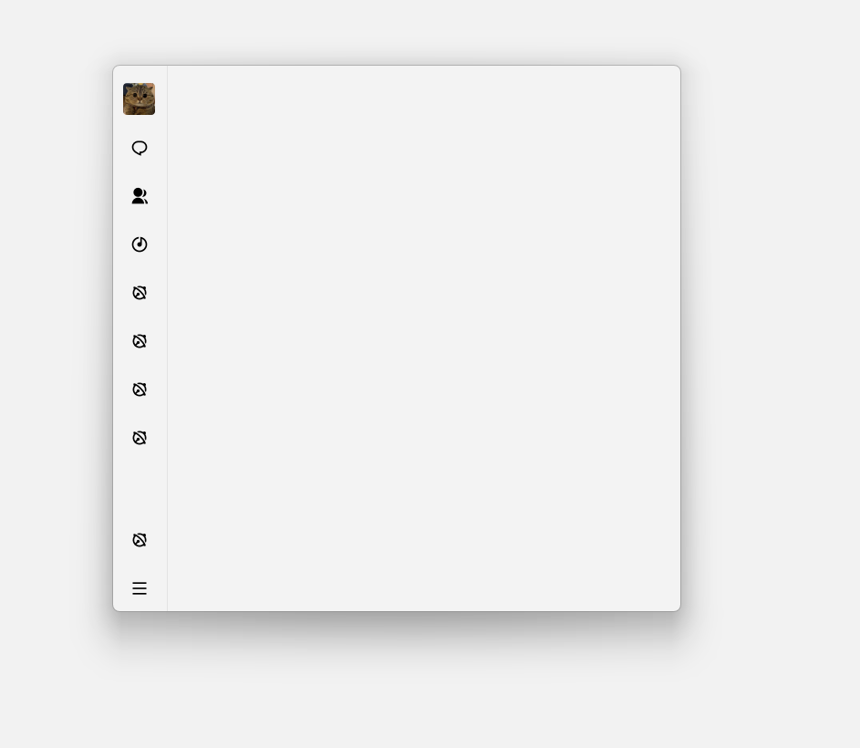
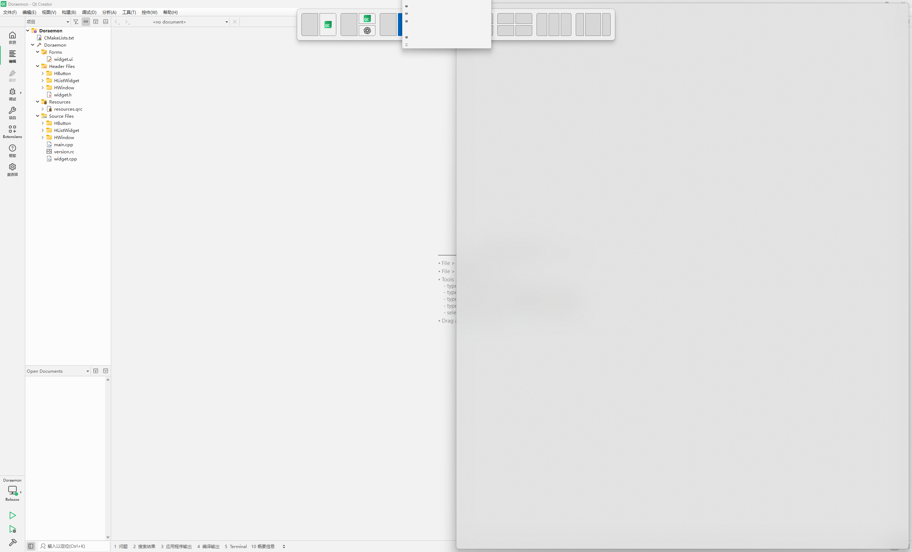

# HWindow

轻量级的 Windows Qt Widgets 无边框窗口辅助组件。

HWindow 在实现无边框窗口外观的同时，保留原生边缘缩放、系统阴影与窗口贴靠行为，并通过可复用的 `HTitleWidget` 容器提供拖动区域。

> **轻量实现：无边框窗口核心逻辑仅一百多行代码。**

## 功能特性

- 无边框窗口外观与原生边缘缩放
- Windows 系统阴影与窗口贴靠支持
- 可复用的 `HTitleWidget` 拖动区域
- 同一窗口支持多个 `HTitleWidget`
- `HTitleWidget` 可包含布局、按钮及其他子控件
- 双击拖动区域可最大化或还原窗口

## 运行效果

### 圆角与阴影效果



### Windows 原生贴边预览



## 环境要求

- Windows
- Qt Widgets
- C++17

## Qt 版本兼容性

当前实现以 Qt 6 开发并完成验证。由于 Qt 5 与 Qt 6 的部分事件 API 不具备源码级兼容性，使用 Qt 5 构建时需要进行条件编译适配。

具体而言，`QWidget::nativeEvent` 的结果参数在 Qt 6 中为 `qintptr *`，在 Qt 5 中为 `long *`；`QMouseEvent` 的全局坐标访问接口也不同：Qt 6 使用 `globalPosition()`，Qt 5 使用 `globalPos()`。

使用 Qt 5 时，请通过 `QT_VERSION >= QT_VERSION_CHECK(6, 0, 0)` 等条件编译选择对应 API。该适配仅用于处理编译期接口差异，不改变窗口功能与交互行为。

## 快速开始

将 `hwindow.h` 与 `hwindow.cpp` 加入项目，并让顶层窗口继承 `HWidget`：

```cpp
#include "hwindow.h"

class Widget : public HWidget
{
    Q_OBJECT

public:
    explicit Widget(QWidget *parent = nullptr);
};
```

在 Qt Designer 中，将需要作为拖动区域的 `QWidget` 提升为 `HTitleWidget`。`HTitleWidget` 可以放置在布局中的任意位置；同一窗口可使用多个实例，且每个实例均可容纳任意子控件。

## CMake

```cmake
target_sources(YourApp PRIVATE
    hwindow.h
    hwindow.cpp
)

target_link_libraries(YourApp PRIVATE
    Qt${QT_VERSION_MAJOR}::Widgets
)

if (WIN32)
    target_link_libraries(YourApp PRIVATE dwmapi)
endif()
```

## 示例

Qt 6 示例项目位于 [Demo_Qt6/Doraemon](Demo_Qt6/Doraemon)。

## 开源协议

本项目采用 [MIT License](LICENSE) 开源协议。

## 作者

- Huang Xiaosong (woshixs)
- GitHub: [@woshi-xs](https://github.com/woshi-xs)
- Email: woshixs123@gmail.com
